# 🚀 SafeDrop - Next-Gen School Management Platform

<div align="center">


**Revolutionizing School Pickup Management with Real-Time Intelligence**

[](https://netlify.com)
[](https://railway.app)

</div>

---

## 🌟 **What is SafeDrop?**

SafeDrop is a **cutting-edge school management ecosystem** that transforms how schools handle student pickup and drop-off operations. Built with modern technologies and real-time capabilities, it provides unprecedented visibility and control over student safety and logistics.

### 🎯 **Core Mission**

> _"Empowering schools with intelligent, real-time student management that ensures every child's safety while streamlining administrative operations."_

---

## ✨ **Revolutionary Features**

### 🎓 **Smart Student Management**

- **Intelligent Tracking**: Real-time student status monitoring
- **Grade-Based Organization**: Seamless classroom management
- **Digital ID System**: Advanced card-based identification
- **Location Intelligence**: GPS-powered pickup zone management

### 👨‍👩‍👧‍👦 **Parent Empowerment Portal**

- **Instant Notifications**: Real-time status updates via WebSocket
- **Smart Pickup Requests**: One-tap pickup scheduling
- **Location Verification**: GPS-based pickup zone compliance
- **Audio Alerts**: Customizable notification sounds

### 👨‍🏫 **Teacher Dashboard Excellence**

- **Live Status Monitoring**: Real-time classroom overview
- **Quick Actions**: Instant status updates and management
- **Grade-Specific Views**: Tailored classroom experiences
- **Emergency Protocols**: Rapid response capabilities

### 🎛️ **Admin Command Center**

- **Comprehensive Analytics**: Data-driven insights and reporting
- **User Management**: Advanced role-based access control
- **Financial Tracking**: Student account and payment monitoring
- **System Health**: Real-time performance and security monitoring

### 🔄 **Real-Time Intelligence**

- **WebSocket Integration**: Instant status synchronization
- **Live Updates**: Real-time data across all platforms
- **Smart Notifications**: Context-aware alert system
- **Performance Monitoring**: Continuous system optimization

---

## 🛠️ **Technology Arsenal**

<div align="center">

|                                             **Frontend**                                             |                                         **Backend**                                          |                                           **Database**                                            |                                             **Real-Time**                                             |
| :--------------------------------------------------------------------------------------------------: | :------------------------------------------------------------------------------------------: | :-----------------------------------------------------------------------------------------------: | :---------------------------------------------------------------------------------------------------: |
|                  |       |  |  |
|    |        |               |        |
|  |     |                |        |
|                      |  |   |               |

</div>

---

## 🚀 **Project Structure**

```
SafeDrop/
├── frontend/          # React + TypeScript + Vite frontend
│   ├── src/          # Source code
│   ├── public/       # Static assets
│   └── package.json  # Frontend dependencies
├── backend/          # NestJS + Prisma backend
│   ├── src/          # Source code
│   ├── prisma/       # Database schema
│   └── package.json  # Backend dependencies
└── package.json      # Root workspace configuration
```

## 🚀 **Deployment Architecture**

```mermaid
graph TB
    A[🌐 Frontend - Vite] --> B[🔌 API Gateway]
    B --> C[⚡ Backend - NestJS]
    C --> D[🗄️ PostgreSQL Database]
    C --> E[📡 WebSocket Server]
    E --> F[📱 Real-time Updates]

    style A fill:#646CFF
    style C fill:#E0234E
    style D fill:#336791
    style E fill:#00C7B7
```

<div align="center">



</div>

---

## 🚀 **Quick Start**

### Prerequisites

- Node.js 18+ and npm
- PostgreSQL database

### Installation

```bash
# Clone the repository
git clone <your-repo-url>
cd SafeDrop

# Install all dependencies
npm run install:all

# Set up environment variables
cp backend/.env.example backend/.env
# Edit backend/.env with your database credentials

# Generate Prisma client
cd backend && npm run prisma:generate

# Run database migrations
npm run prisma:migrate

# Start development servers
npm run dev
```

### Development Commands

```bash
# Start both frontend and backend
npm run dev

# Start only frontend
npm run dev:frontend

# Start only backend
npm run dev:backend

# Build both projects
npm run build

# Run tests
npm run test
```

## 🎨 **User Experience Highlights**

### 📱 **Responsive Design**

- **Mobile-First**: Optimized for all devices
- **Progressive Web App**: Native app-like experience
- **Accessibility**: WCAG 2.1 compliant
- **Performance**: Lightning-fast loading times

### 🔐 **Security & Privacy**

- **Role-Based Access**: Granular permission system
- **JWT Authentication**: Industry-standard security
- **Data Encryption**: End-to-end protection
- **GDPR Compliance**: Privacy-first approach

### 📊 **Analytics & Insights**

- **Real-Time Metrics**: Live performance monitoring
- **Custom Reports**: Tailored data visualization
- **Export Capabilities**: Flexible data management
- **Trend Analysis**: Predictive insights

---

## 🌟 **Why SafeDrop?**

| **Traditional Systems** |      **SafeDrop Platform**       |
| :---------------------: | :------------------------------: |
|   ❌ Manual processes   |    ✅ **Automated workflows**    |
|   ❌ Delayed updates    | ✅ **Real-time synchronization** |
|  ❌ Limited visibility  |   ✅ **Complete transparency**   |
| ❌ Paper-based tracking |    ✅ **Digital excellence**     |
|  ❌ Reactive responses  |  ✅ **Proactive intelligence**   |
|    ❌ Isolated data     |   ✅ **Integrated ecosystem**    |

---

## 🎯 **Target Impact**

- **🏫 Schools**: Streamlined operations, enhanced safety
- **👨‍👩‍👧‍👦 Parents**: Peace of mind, convenience
- **👨‍🏫 Teachers**: Efficient management, better oversight
- **👨‍💼 Administrators**: Data-driven decisions, cost savings
- **🚌 Transportation**: Optimized logistics, reduced delays

---

<div align="center">

**🚀 Ready to revolutionize your school's pickup management?**

_Built with ❤️ for the future of education_

[](https://github.com/gns-x/SafeDrop)
[](https://github.com/gns-x/SafeDrop)

</div>
